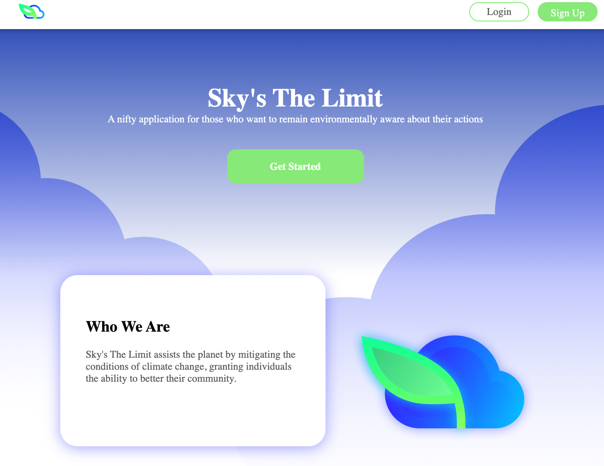

## Sky's The Limit

Sky's The Limit — Project created for CUNY Hackathon, Spring 2021  
Try it here: [Live Demo](https://cindysu123.github.io/Hackathon-Jan23/)

## Description

Sky’s The Limit tackles the pervasiveness of climate change by incentivizes users make eco friendly decisions in their daily lives. Our unique star points system grants discounts in our marketplace where companies can advertise services, products and discounts.

